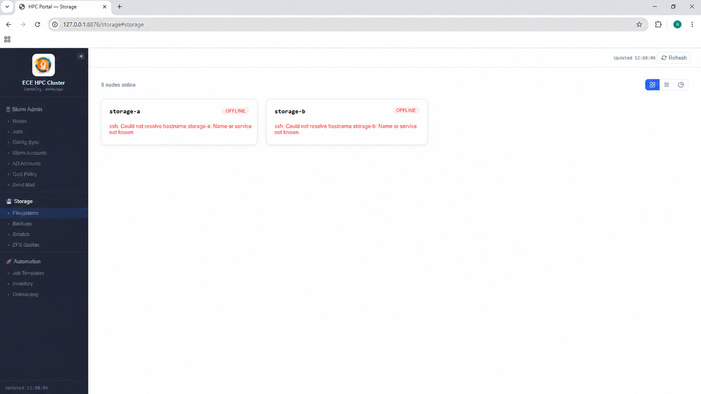
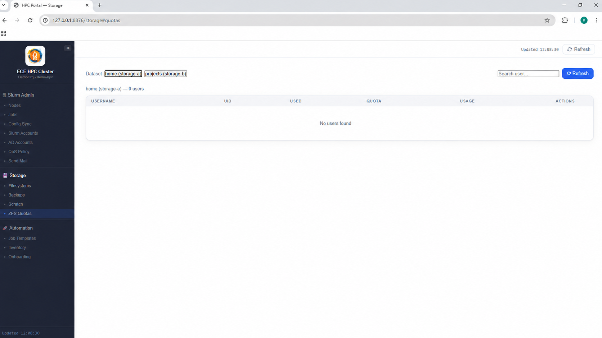
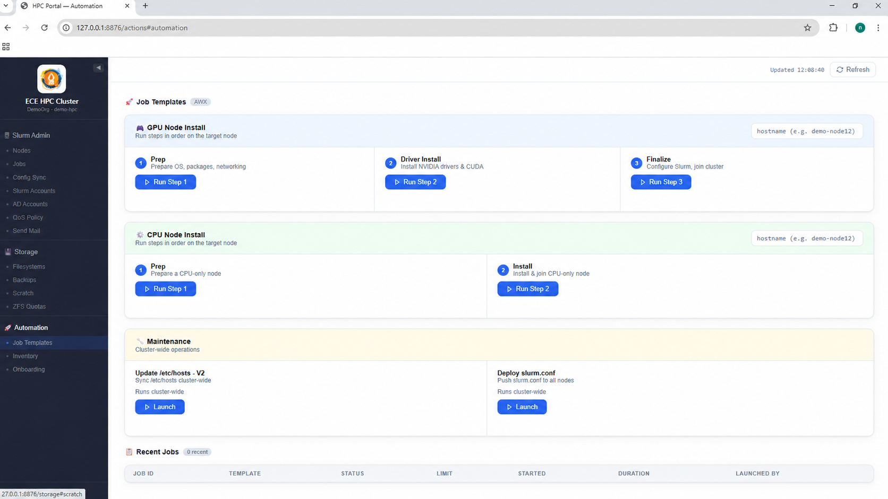
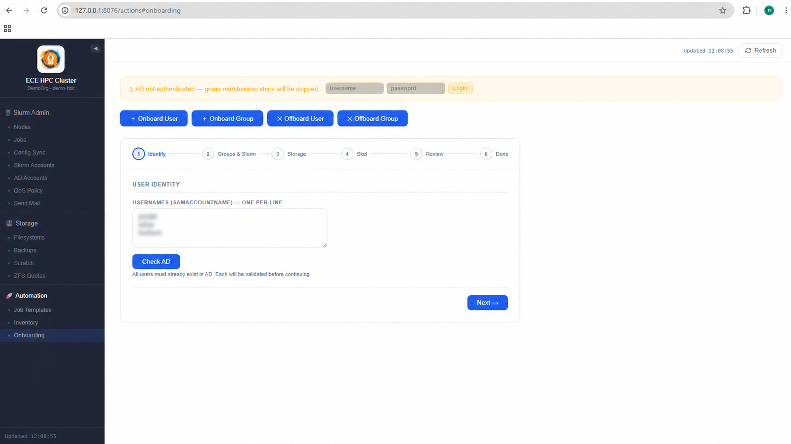
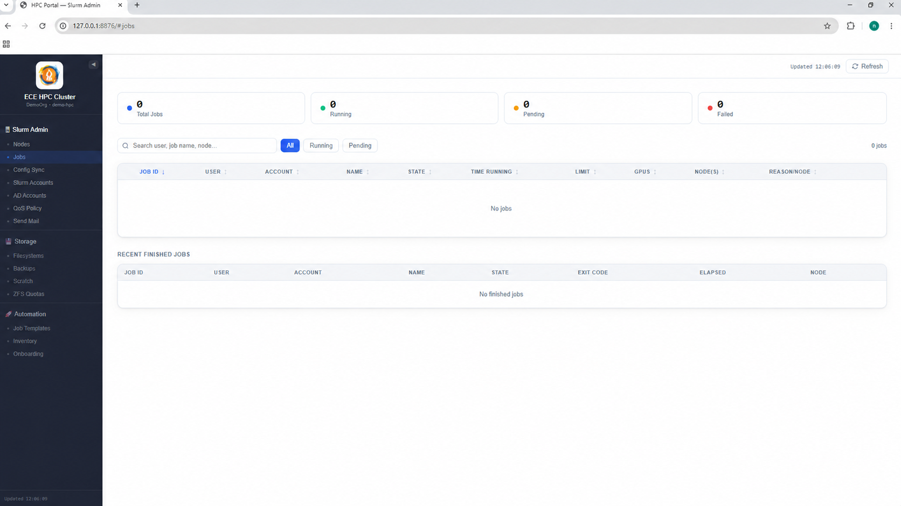
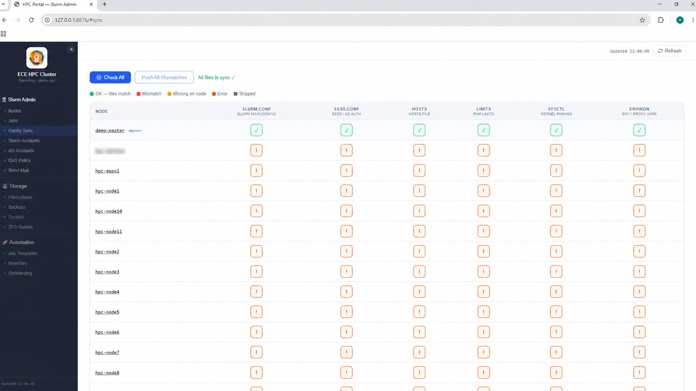
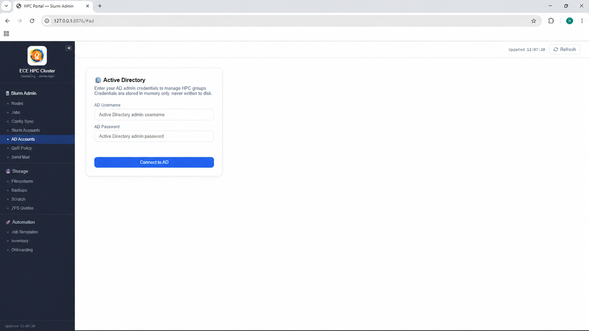
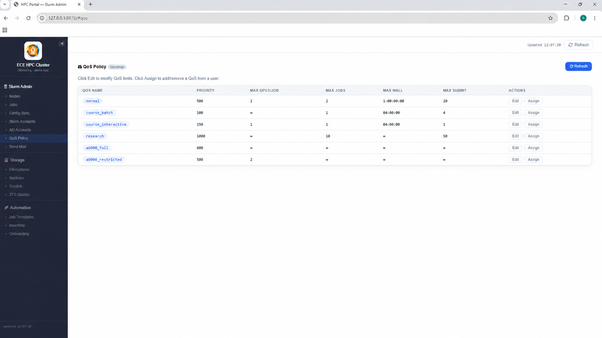
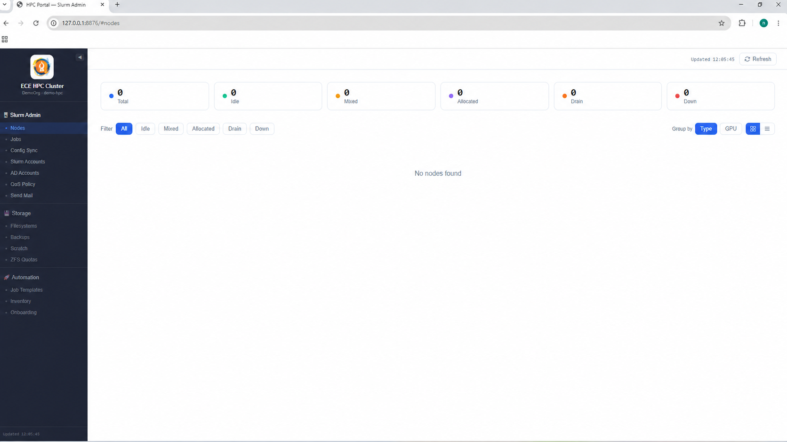
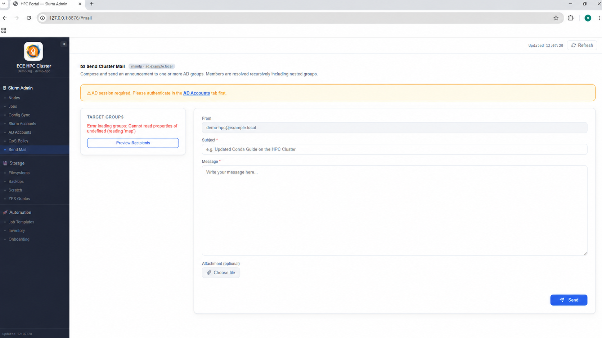

# HPC Admin Portal Demo

A demo-safe web portal for HPC administration workflows.

This project showcases a FastAPI-based internal operations dashboard for:

- Slurm node and job visibility
- Slurm account/QoS administration UI
- AWX automation launcher UI
- Active Directory / LDAP account workflow UI
- Storage, quota, and filesystem management UI

## Demo safety

This repository is sanitized for public sharing.

It uses example hostnames, example domains, and placeholder configuration values.
Real infrastructure names, IP addresses, tokens, user/group names, and institution-specific identifiers have been removed.

## Tech stack

- Python
- FastAPI
- Uvicorn
- Jinja2 templates
- YAML configuration
- Slurm / AWX / LDAP integration points

## Run locally

1. Create a virtual environment:

    python3 -m venv .venv

2. Activate it:

    source .venv/bin/activate

3. Install dependencies:

    pip install -r requirements.txt

4. Create local config:

    cp config.example.yaml config.yaml

5. Run:

    uvicorn app.main:app --host 127.0.0.1 --port 8876

Open:

    http://127.0.0.1:8876

## Notes

External integrations require real environment-specific configuration and are intentionally represented with demo placeholders.

## Screenshots

### Storage Filesystems

### ZFS Quotas

### Automation

### Onboarding

### Jobs

### Config Sync

### AD Accounts

### QoS Policy

### Jobs Alternative View

### SMTP Mail System

